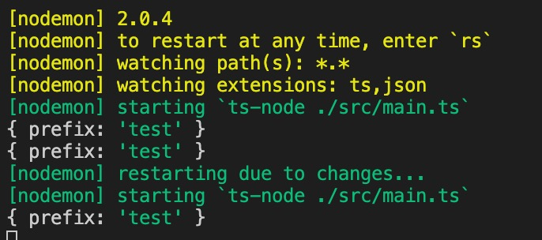

1. 我们使用koa 作为web 服务项目,安装koa 相关的插件

        npm install koa -S  // koa 框架

        npm install koa-router -S // koa 路由框架

        npm install koa-body -S  // 解析body 和文件上传

        npm install koa-static-cache -S// 静态资源，带有缓存

        npm install ioredis -S  // redis 操作

        npm install sequelize -S // 操作数据库ORM

        npm install koa-jwt -S // jwt 操作

2. 安装types ，一些插件已经自带了types 声明，因此不需要我们安装,声明安装在本地依赖，因为只有本地开发环境用的到，线上是生成的js 文件

        npm install @types/koa -D
        
        npm install @types/koa-router -D

        npm install @types/sequelize -D

3. 创建koa 服务

        src/main.ts

        import Koa from 'koa'

        const app = new Koa();

        app.use(async ctx=>{
                ctx.body="hello koa-typescript";
        });

        app.list(4000,()=>{
                cosnole.log('start at 4000')
        })

4. 在package.json 中配置script 运行命令

        "script":{
              "compile" : "npx tsc && node ./dist/main.js"
        }

5. 生成js:

   

6. 本地开发环境我们希望能够保存代码后自动重启服务

        nodemon 本身提供node.js 的执行比如

        nodemon server.js  ===>node server.js

        nodemon 也支持飞node 的程序,比如

        nodemon --exec "python -v" ./app.py

        我们让我们的ts 程序自动重启

        nodemon --exec ts-node ./src/main.ts

   
