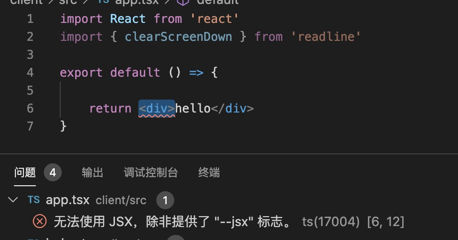
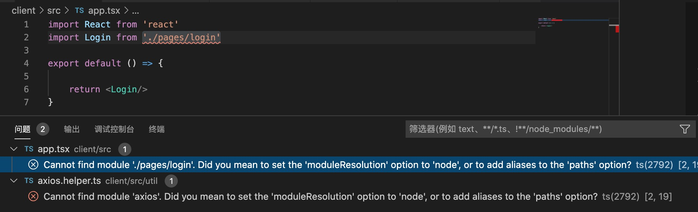

1. 创建目录

        mkdir client // 客户端目录
               |
               |-----build
               |        |     |--webpack.base.config.js
               |        |-----|
               |              |--webpack.dev.config.js
               |              |
               |              |--webpack.production.config.js
               |
               |----src ：源文件目录
               |
               |
               |----.babelrc ： babel 配置文件
               |
               |----.post-css:  post css 配置文件
               |
               |
               |----package.json

2. 初始化package.json 

        npm init -y

        修改package.json 

         "main": "index.tsx",  // 默认为index.js ，修改为index.tsx ,不然不能使用目录引入自动导航到index.tsx

3. 安装webpack 

        npm install webpack webpack-cli -D  

        本地安装，多人协同办公保证webpack 版本一致，不会因为版本的原因打包错误

4. 安装typescript

        npm install typescript -D
        npm install @types/node -D

5. 安装react 全家桶

        npm install react react-dom -S  // react 和 react-dom
        npm install react-router-dom -S // react 路由
        // 安装支持typescript 的@types 声明

        npm install @types/react -S
        npm install @types/react-dom -S
        npm install @types/react-router-dom -S

6. 安装axios 作为http 请求

        npm install axios -S
        npm install @types/axios -S

7. 安装ui 攻击库 antd

        npm install antd -S // 本身支持typescript 所以不需要@types 声明

8. 生成typescript 配置文件 tsconfig.js

        npx tsc --init 

        配置可以使用jsx

        "jsx": "react"

        不然会报错

   

        配置  "moduleResolution": "node",  不然导入模块会报错   

    

9. 下一步配置webpack

