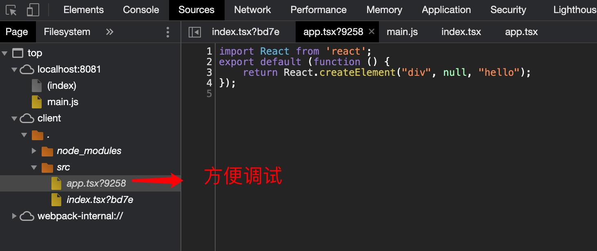

1. webpack 开发环境配置

+ mode: 'development'  开发模式配置

+ devtool: 配置source Map ，可以方便开发阶段帮助我们调试js 和 错误

   

+ devServer: 本地开发环境配置

   > webpack5 (2020.11) 使用过程中和webpack-dev-server 冲突，使用webpack-cli/serve 代替webpack-dev-server

+ host: 域名，默认为127.0.0.1

+ port： 默认为3000

+ open: true/false // 是否自动打开浏览器

+ hot: true/false  // 热更新

        plugins:[
            new webpack.HotModuleReplacementPlugin()
        ]

+ hotOnly: true/false // 不刷新页面，热更新

+ proxy: 代理

        proxy:{
            '/api':{
                target:''
            }
        }

        proxy:{
            '/api':''
        }

+ publicPath:

> 启动devServer :  

        "scripts": {
            "dev": "webpack serve --config ./build/webpack.dev.config.js"
        },