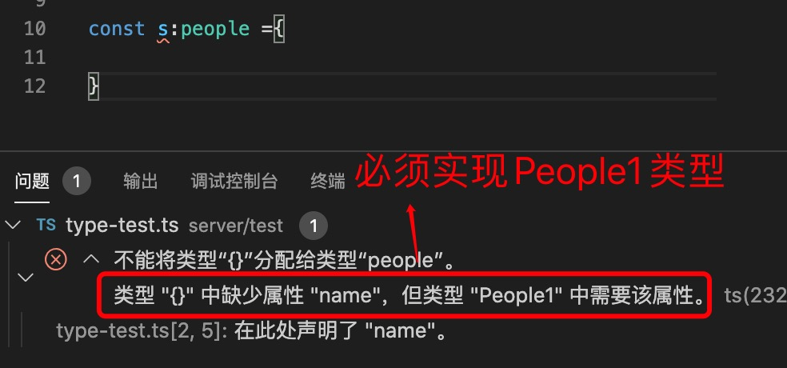
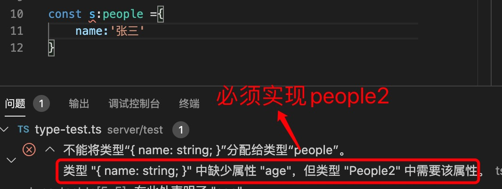

1. JavaScript 基础类型

   number ,string,boolean,null,undefined,symbol

   typescript 对应的

   + number: 数字类型，因为JavaScript所有数字类型都是浮点数，因此使用一个number 定义

          let a :number =2; // 
    
    + string : 字符串类型

          let b:string ="hello";
    
    + bool： 布尔类型 ,true/false

            let c:boolean =true;
    + null:

            let c:null=null;
    + undefined

            let d:undefined =undefined;
    + symbol

    + Date: // 时间类型

            interface IUserAttribute{
                  createdAt:Date,
                  updatedAt:Date
            }

> typescript 中 null  和 undefined 是所有类型的子类型，但是当开启了   "strict": true,     和   "strictNullChecks": true, 检查，就不能给变量赋值null ,除非定义了null 或 undefined 类型

   + 当设置strictNullChecks：false  时：

            let a:number =null ;// 是正确的

            let a:number =null;
            a=3;
            console.log(a); // 输出3

   + 当设置了strictNullChecks：true 时：

            let a:number =null; // 错误
            a=3;
            console.log(a); 

   

2. typescript 引用类型

+ 元组 tuple ，元组是一个存放任意类型的集合，同JavaScript一样

   元组使用tuple() 表示

+ 数组： typescript 中是一组类型相同的集合，即数组中所有元素拥有同一种类型

      // 数组的两种表现形式

      let a:number[] =[] ;

      let b:Array<number> =[];

+ 函数

   javascript 中所有函数可以赋值给变量，参数，作为对象中的方法，因此typescript 也有相应的声明

            let add:()=>void;

+ 接口 定义一个对象形式

            interface People{
                  name:string,
                  age:number
            }

+ 类 class

            class People{
                  name:string;
                  age:number;  // es7 支持的语法
                  constructor(){

                  }
            }

+ Object

+ any： 可以是任意类型，

   any 和JavaScript一样，声明的变量可以是任意类型，但是他的缺点也很明显，加入我们使用了any类型变量，只有一种类型才有的方法，但是any 类型不会去检查，因此在运行时就会报错，比如

            function show(p:any){
                  return p.splice(',');
            }

            show('1,2,4,3');// 这个是正确的

            show(123);// 这就出错了

3. 高级类型

+ & ： 交叉类型

   交叉类型是将多个类型合并为一个类型。 这让我们可以把现有的多种类型叠加到一起成为一种类型，它包含了所需的所有类型的特性

            interface People1{
                  name:string
            }
            interface People2{
                  age:number
            }

            type people = People1 & People2;

            // 实现people 类

            const s:people ={}
   

   因此：

            const s:people ={
                  name:'张三'
            }

   

            const s:people ={
                  name:'张三',
                  age:14
            }

            因此可以看出交叉类型是两个类型的合集,实现类必须实现全部接口的属性

            people 类型相当于

            interface people{
                  name:string,
                  age:number
            }

+ | ：联合类型，表示或

      const a:string | null =null;

      表示类型可以是string，亦可以是null， 只要满足其中一个就可以。

      interface People1{
            name:string
      }
      interface People2{
            age:number
      }

      type people = People1 | People2;

      // 下面的都是正确的
      const s:people ={
            name:'张三'
      }

      const s1:people ={
            age:12
      }
      // 这个就相当于两个属性是可选的
      const s:people ={
            name:'张三',
            age:12,
      }

      ====》等同于
      interface people{
            name?:string,
            age?:number
      }

+ 字面量联合类型

      const a ='a' | 'b' |'c';

      表示a 的值只能是a,b,c 其中一个，不然会报错
