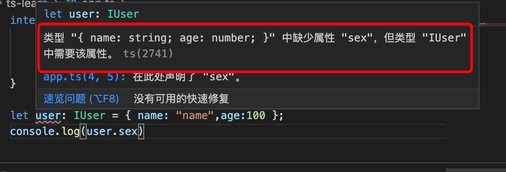

1. as 类型转换

        interface IUser{
            name: string,
            age: number,
            sex:number
        }

        let user: IUser = { name: "name",age:100 }; // 报错
        console.log(user.sex)

   

   但是可以使用as 转换类型

        let user: IUser = { name: "name",age:100 } as IUser; // 转换类型
        console.log(user.sex) // 不存在的为undefined