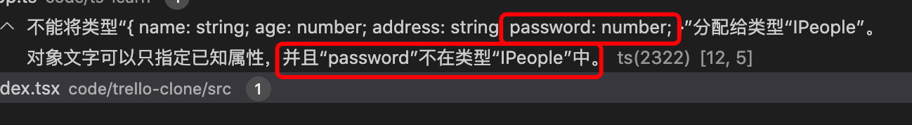

1. interface 接口，抽象定义

> 属性

        interface IPeople{
            name:string,
            age:number,
            address:string,
            sex:number
        }

  + ***实现接口必须要全部实现接口中定义的属性或方法***

        let user:IPeople ={
            name:"zhangsan",
            age:12,
            address:"北京",
            sex:1
        }

   如果有里面的属性没有实现，则会报错，比如：

         let user:IPeople ={
            name:"zhangsan",
            age:12,
            address:"北京"
            // 缺少sex
        }
   

   + 属性不能有没有定义的属性

            let user:IPeople ={
                name:"zhangsan",
                age:12,
                address:"北京",
                password:"admin"  // 多出来的password
            }
            
   

> 可选属性

   使用问号标记属性为可选的，即可以不实现

        interface IPeople{
            name:string,
            age:number,
            address:string,
            sex?:number
        }

        let user:IPeople ={
            name:"zhangsan",
            age:12,
            address:"北京"
        }

   可选属性可以不用实现

> 有时候我们不确定会多出那些属性，因此把所有属性都定义一遍不现实，可以使用索引属性

   ***索引属性运行定义一个或多个属性值***

        interface IPeople{
            name:string,
            age:number,
            sex?:number,
            [key:string]:any
        }

         [key:string]:any// 表示键值是string 类型的，值为any (任意类型)

         interface IPeople{
            name:string,
            age:number,
            sex?:number,
            [key:string]:any
        }

        let user:IPeople ={
            name:"zhangsan",
            age:12,
            address:"北京" // 多出来的属性
            
        }

