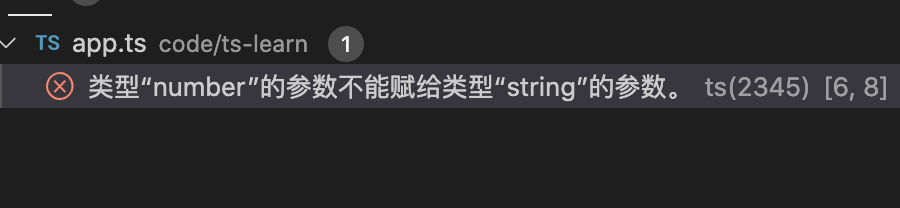

1. typescript 中使用数组有两种方式

        let a :string[] =[];
        
        let b :Array<string> =[]

2. typescript 中的数组和JavaScript数组不一样，typescript 中的数组所有元素必须拥有相同的类型，不然会报错

        let a:string[] =[];
        a.push("hello");// hello 是字符串类型，没有问题

        a.push(2);// 2 是数字类型,导致报错
        // 类型“number”的参数不能赋给类型“string”的参数。

   

3. 要想数组支持字符串和数字类型，可以定义多种类型

        let b:Array<string | number>=[];

        b.push("hello");// 字符串
        b.push(2); // 数字

        console.log(b);//[ 'hello', 2 ]

4. 上面可以使用另一种形式

        type arrStrNum = string | number;
        // type 类型别名

        let b:arrStrNum[] =[];

        let b:Array<arrStrNum> =[];