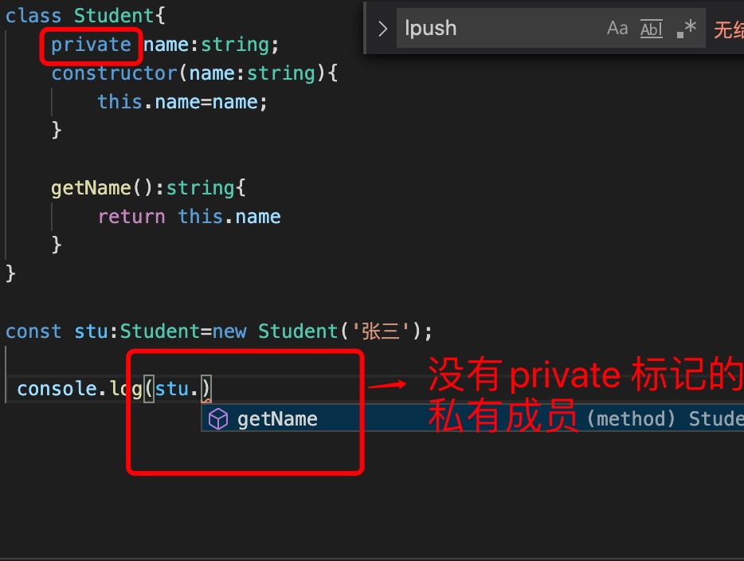

1. 私有变量, 使用#(JavaScript新语法) 标记

        class Student{
            #name:string;
            constructor(name:string){
                this.#name=name;
            }

            getName():string{
                return this.#name
            }
        }

        const stu:Student=new Student('张三');

        console.log(stu.getName())

2. typescript 使用private 标记私有变量

   